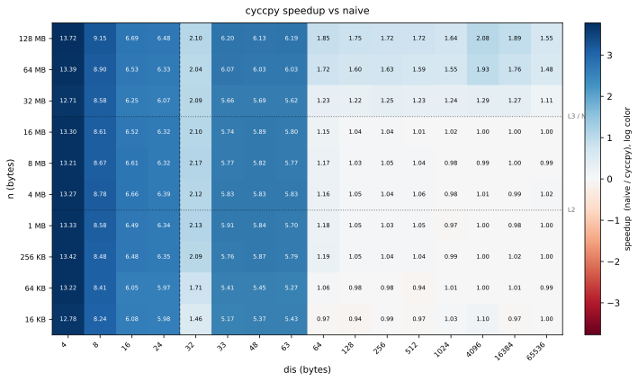
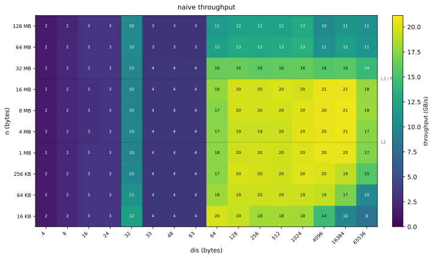
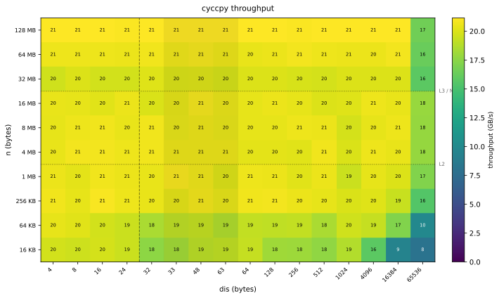

This repository provides a faster implementation of the following function (as compared to GCC and Clang's assembly for it at `-O3 -march=native`, which enables AVX2 on my machine):

```cpp
void f(uint8_t* src, size_t dis, size_t n)
{
    for(size_t i = 0; i < n; i ++)
        src[i + dis] = src[i];
}
```

My implementation (`misacpy::cyccpy`) outperforms the naive assembly by GCC and Clang (`-O3 -march=native`) at all `dis <= 200`, with diminishing returns for increasing `dis`.

Most of the performance gains are due to the following reasons:

- At `dis < 32`, both GCC and Clang are not able to vectorize the loop with 256 bit avx registers.
- At smaller distances, naive vectorization struggles because of Store-To-Load Forwarding stalls (prefixes/suffixes of the 32 byte window starting at `src + (i + dis)` are read soon after `sr[i + dis, i + dis + 32)` is written for smaller `dis`, and the latter may not have been flushed from the store-buffer to L1 by then). My implementation almost completely eliminates these from the hot loop.
- I also manually unrolled the loop twice and made the two instances of "load and then store" in an iteration mostly independent from one another. This helps a bit with OoO execution on my CPU as there are multiple load and store ports. The initial setup done to allow this is a bit heavier but it easily amortizes over larger `n`, and I don't care much about smaller `n` here anyway (although I might try to improve latency for small `n` soon too... but that would likely be totally disjoint from the handling of larger `n`).
- At larger `n` and smaller `dis`, we can notice that most of the data we write is never read, so I use non-temporal stores here.

Some results on my i7-14650HX CPU, with turbo disabled (benchmark code is in the `bench` directory) follow.

### Speedup



### naive throughput



### `misacpy` throughput



## Requirements

- Linux (for `scripts/quiet-run.sh`'s `/sys` paths)
- A C++17 compiler (GCC or Clang)
- CMake >= 3.16
- A CPU with AVX2 support
- `sudo` access (used by `scripts/quiet-run.sh` to lock cpufreq governor and turbo for stable benchmarking)

To benchmark the loop on your device, clone the repository, `cd` into it, and run the following commands:

```bash
cmake -S bench -B bench/build
cmake --build bench/build
# Uses sudo to lock cpufreq governor and turbo, then runs the bench pinned to one core.
./scripts/quiet-run.sh ./bench/build/misacpy_bench
```